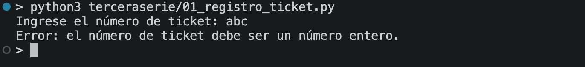
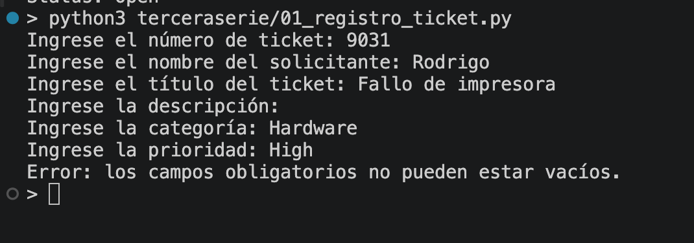
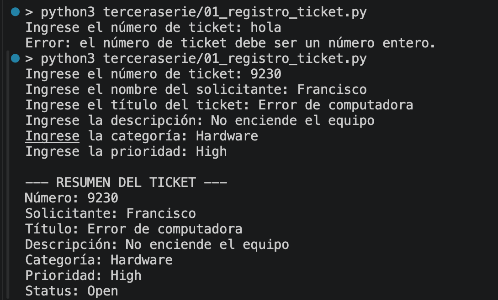
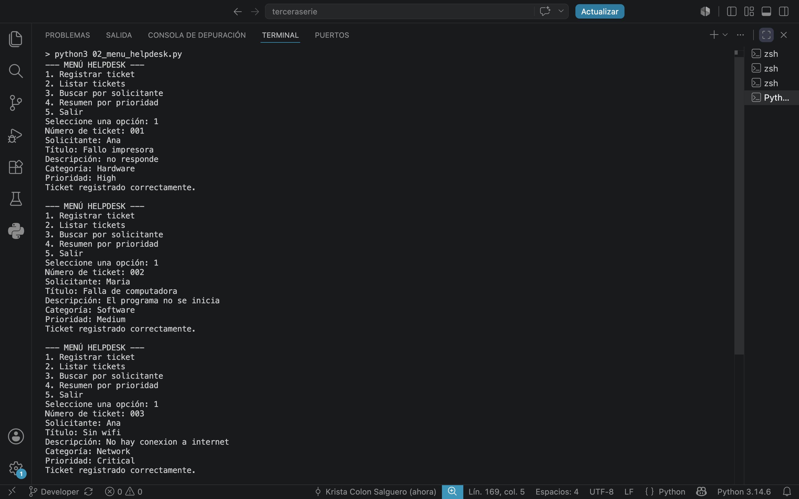
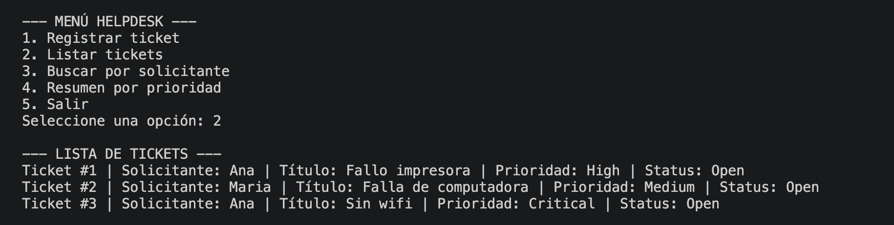
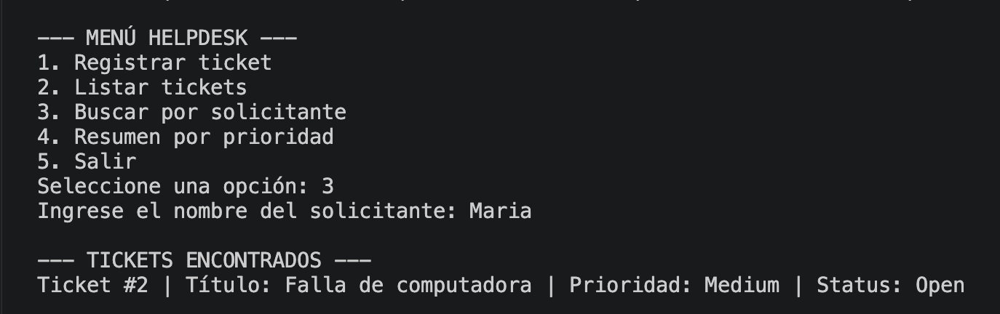
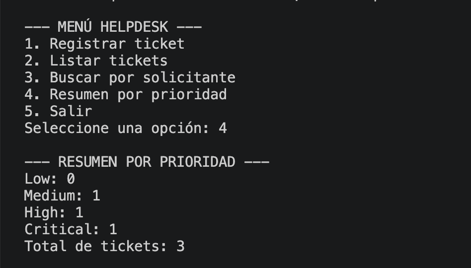

# progra2-terceraserie
Tercera serie, primer parcial

## EJERCICIO 1 - Registro de Ticket

### Enunciado

Construir un primer registro usando entrada, conversión, condicionales, listas y diccionarios.

El programa debe solicitar número de ticket, solicitante, título, descripción, categoría y prioridad. También debe validar el número con `try/except ValueError`, rechazar campos obligatorios vacíos, validar la categoría y prioridad, guardar el registro en un diccionario con estado inicial `Open` y mostrar un resumen utilizando f-strings.

### Descripción

Programa de consola para registrar un ticket de soporte. Nos permite ingresar los datos principales del ticket, validar la información ingresada y mostrar un resumen final del registro creado.

### Evidencias

#### Número de ticket inválido

#### Campo que es obligatorio, vacío

#### Registro correcto

## EJERCICIO 02 - Menú HelpDesk

### Enunciado

Refactorizar el registro anterior como un programa modular que mantenga varios tickets durante la ejecución.

El programa debe permitir registrar, listar y buscar tickets por solicitante, mostrar un resumen por prioridad y salir mediante un menú. Los tickets se almacenan utilizando una lista de diccionarios.

### Descripción

Programa de consola para administrar varios tickets durante una misma ejecución. Permite registrar tickets, consultar los registros existentes, buscar por solicitante y ver la cantidad de tickets según su prioridad.

### Evidencias

#### Registro de tres tickets

#### Listado de tickets

#### Búsqueda por solicitante

#### Resumen por prioridad

